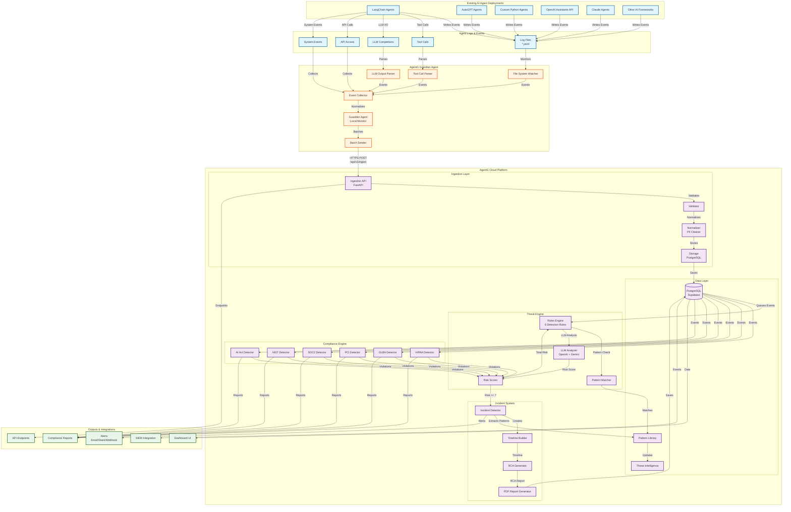
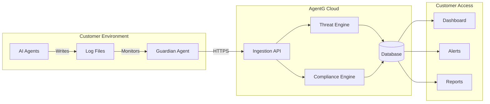

# AgentG Integration with Existing AI Deployments

**Version:** 1.0  
**Date:** 2024-01-15

This document illustrates how AgentG integrates with existing AI agent deployments to provide security and compliance monitoring without requiring code changes.

---

## System Integration Diagram



---

## Integration Flow

### 1. **Existing AI Agent Deployments** (No Changes Required)

AgentG works with any AI agent framework that can write logs:
- **LangChain Agents**: Monitors tool calls and LLM interactions
- **AutoGPT**: Tracks autonomous agent behavior
- **Custom Python Agents**: Works with any Python-based agent
- **OpenAI Assistants API**: Monitors API interactions
- **Claude Agents**: Tracks Anthropic Claude usage
- **Other Frameworks**: Universal compatibility via log monitoring

**Key Point**: No code changes required. AgentG monitors log files.

---

### 2. **Event Collection** (Guardian Agent)

The Guardian Agent runs locally alongside your AI agents:

- **File System Watcher**: Monitors `*.jsonl` log files
- **Event Collector**: Collects events from logs
- **Tool Call Parser**: Extracts tool usage patterns
- **LLM Output Parser**: Analyzes LLM prompts/responses
- **Batch Sender**: Efficiently sends events to cloud

**Deployment**: Single Python agent, minimal resource usage.

---

### 3. **Cloud Processing** (AgentG Platform)

Events are processed in the cloud:

#### Ingestion Layer
- **Validates** event structure
- **Normalizes** to canonical format
- **Removes PII** before storage
- **Stores** in PostgreSQL database

#### Threat Engine
- **Rules Engine**: 6 threat detection rules
- **Pattern Matcher**: Matches against pattern library
- **LLM Analyzer**: Multi-model consensus (OpenAI + Gemini)
- **Risk Scorer**: Calculates unified risk score

#### Compliance Engine
- **6 Compliance Standards**: HIPAA, GLBA, PCI, SOC2, NIST, EU AI Act
- **Automated Detection**: Continuous compliance monitoring
- **Evidence Collection**: Audit-ready evidence

#### Incident System
- **Automatic Detection**: Creates incidents when risk >= 7
- **Timeline Building**: Chronological event timeline
- **RCA Generation**: AI-powered root cause analysis
- **PDF Reports**: Professional incident reports

---

### 4. **Outputs & Integrations**

#### Alerts
- **Real-time Notifications**: Email, Slack, Webhook
- **Severity-based**: Critical, High, Medium, Low
- **Actionable**: Includes remediation steps

#### Compliance Reports
- **Automated Reports**: Per compliance standard
- **Audit-Ready**: Evidence and documentation
- **Scheduled**: Regular compliance reports

#### Dashboard UI
- **Real-time Monitoring**: Live threat dashboard
- **Compliance Dashboards**: Per-standard views
- **Incident Management**: Incident tracking and resolution

#### SIEM Integration
- **Standard Formats**: Syslog, JSON, API
- **Security Tools**: Splunk, Datadog, New Relic
- **Orchestration**: Security automation platforms

#### API Endpoints
- **REST API**: Full programmatic access
- **Webhooks**: Event-driven integrations
- **SDKs**: Python, JavaScript, Go

---

## Integration Methods

### Method 1: Log File Monitoring (Recommended)

**How it works:**
1. Your AI agents write events to `*.jsonl` files
2. Guardian Agent monitors these files
3. Events are collected and sent to AgentG cloud

**Advantages:**
- ✅ No code changes required
- ✅ Works with any framework
- ✅ Minimal performance impact
- ✅ Easy to deploy

**Example:**
```python
# Your existing agent code (no changes needed)
agent.run("Process this data")
# Agent writes to: /var/log/agents/agent_001.jsonl
```

---

### Method 2: SDK Integration

**How it works:**
1. Install AgentG SDK
2. Add event tracking to your agent code
3. Events sent directly to AgentG

**Advantages:**
- ✅ More control over events
- ✅ Real-time monitoring
- ✅ Custom event types

**Example:**
```python
from agentg import AgentG

agentg = AgentG(api_key="your_key")

# Track tool call
agentg.track_tool_call(
    tool_name="file_write",
    args={"path": "/tmp/data.txt"},
    risk_score=2
)

# Track LLM completion
agentg.track_llm_completion(
    prompt="User query...",
    response="Agent response...",
    risk_score=1
)
```

---

### Method 3: API Integration

**How it works:**
1. Your agents make HTTP POST requests to AgentG API
2. Events are validated and processed
3. Real-time threat detection

**Advantages:**
- ✅ Direct integration
- ✅ Real-time processing
- ✅ Full control

**Example:**
```python
import requests

response = requests.post(
    "https://shield.mangotec.ai/api/v1/ingest",
    headers={"Authorization": "Bearer your_api_key"},
    json={
        "workspace_id": "ws_123",
        "agent_id": "agent_456",
        "events": [
            {
                "event_type": "llm_completion",
                "payload": {...},
                "risk_local": 2
            }
        ]
    }
)
```

---

### Method 4: Middleware Integration

**How it works:**
1. AgentG middleware wraps your agent calls
2. Automatically tracks all interactions
3. Transparent to your application

**Advantages:**
- ✅ Automatic tracking
- ✅ No code changes
- ✅ Complete coverage

**Example:**
```python
from agentg.middleware import AgentGMiddleware

# Wrap your agent
agent = AgentGMiddleware.wrap(
    your_agent,
    api_key="your_key"
)

# Use normally - all events tracked automatically
agent.run("Process this")
```

---

## Deployment Architecture



---

## Key Benefits

### 1. **Zero Code Changes**
- Works with existing AI deployments
- No agent code modifications required
- Log file monitoring approach

### 2. **Universal Compatibility**
- Works with any AI framework
- Language-agnostic (monitors logs)
- Framework-agnostic

### 3. **Non-Intrusive**
- Minimal performance impact
- No agent slowdown
- Background monitoring

### 4. **Comprehensive Coverage**
- All event types monitored
- Complete threat detection
- Full compliance coverage

### 5. **Real-time Protection**
- Immediate threat detection
- Instant alerts
- Automated response

---

## Integration Checklist

### Step 1: Deploy Guardian Agent
- [ ] Install Guardian Agent on same machine as AI agents
- [ ] Configure log directory path
- [ ] Set API key and endpoint
- [ ] Start Guardian Agent service

### Step 2: Configure Logging
- [ ] Ensure AI agents write to `*.jsonl` files
- [ ] Set log directory to monitored path
- [ ] Verify log format compatibility

### Step 3: Test Integration
- [ ] Run test agent workflow
- [ ] Verify events appear in AgentG dashboard
- [ ] Check threat detection working
- [ ] Validate compliance monitoring

### Step 4: Set Up Alerts
- [ ] Configure email/Slack notifications
- [ ] Set alert thresholds
- [ ] Test alert delivery

### Step 5: Enable Compliance
- [ ] Select compliance standards
- [ ] Configure compliance rules
- [ ] Set up compliance reports

---

## Example Integration Scenarios

### Scenario 1: LangChain Agent

```python
# Your existing LangChain agent (no changes)
from langchain.agents import initialize_agent
from langchain.llms import OpenAI

llm = OpenAI(temperature=0)
agent = initialize_agent(tools, llm, agent="zero-shot-react-description")

# AgentG monitors via log files
# No code changes needed!
agent.run("What's the weather in San Francisco?")
```

### Scenario 2: Custom Python Agent

```python
# Your existing custom agent
class MyAgent:
    def run(self, task):
        # Your agent logic
        result = self.process(task)
        return result

# AgentG monitors via log files
# No code changes needed!
agent = MyAgent()
agent.run("Process customer data")
```

### Scenario 3: OpenAI Assistants API

```python
# Your existing OpenAI Assistant code
import openai

assistant = openai.Assistant.create(
    name="Customer Support",
    instructions="Help customers...",
    model="gpt-4"
)

# AgentG monitors via API logs
# No code changes needed!
```

---

## Security & Privacy

### Data Protection
- **PII Removal**: All PII removed before storage
- **Encryption**: Data encrypted in transit and at rest
- **Access Control**: Workspace isolation
- **Compliance**: SOC 2, ISO 27001 ready

### Privacy
- **No Code Access**: AgentG never accesses your code
- **Log Monitoring Only**: Only monitors log files
- **Anonymized Intelligence**: Threat intelligence anonymized
- **Customer Control**: Full data control

---

## Support & Documentation

### Getting Started
- **Quick Start Guide**: `QUICKSTART.md`
- **Setup Instructions**: `SUPABASE_SETUP.md`
- **Architecture Docs**: `ARCHITECTURE.md`

### Integration Help
- **API Documentation**: REST API docs
- **SDK Documentation**: Python, JavaScript, Go
- **Example Code**: Integration examples
- **Support**: Email, Slack, GitHub Issues

---

## Conclusion

AgentG integrates seamlessly with existing AI deployments through **log file monitoring**, requiring **zero code changes**. The Guardian Agent runs locally, monitors your agent logs, and sends events to the AgentG cloud platform for comprehensive security and compliance monitoring.

**Key Advantages:**
- ✅ No code changes required
- ✅ Works with any AI framework
- ✅ Non-intrusive monitoring
- ✅ Comprehensive protection
- ✅ Real-time threat detection
- ✅ Automated compliance

---

**Ready to integrate?** See `QUICKSTART.md` for step-by-step instructions.

